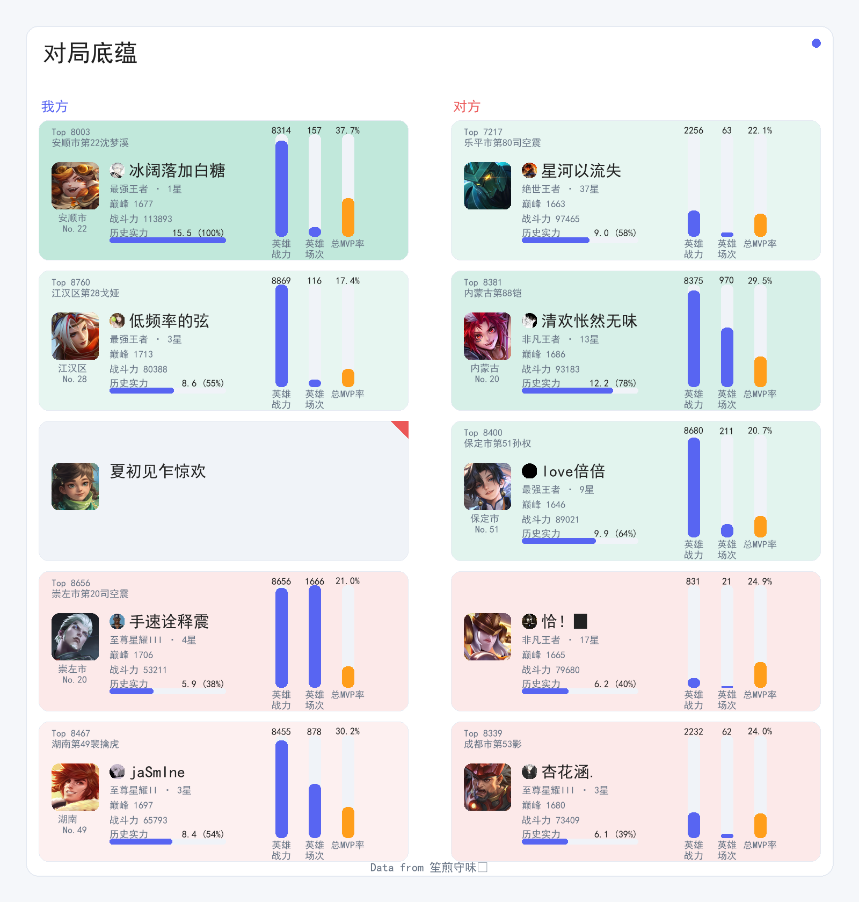
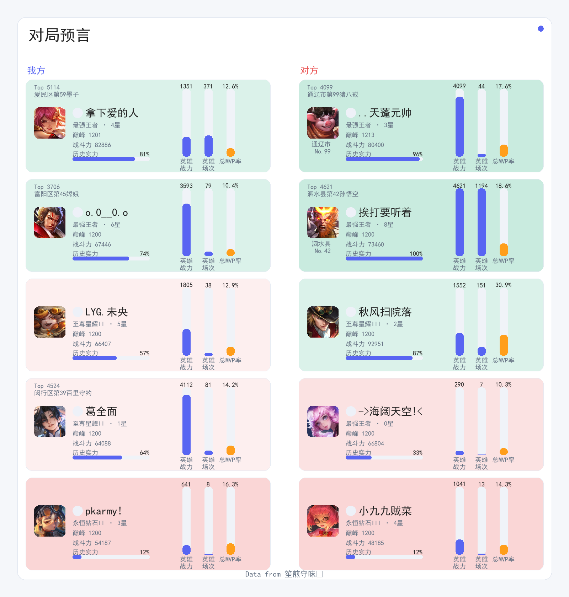

# HOK_QQBot 使用手册

[](https://github.com/zhdxlz/HOK_QQBot_showcase)

## 目录

- [HOK\_QQBot 使用手册](#hok_qqbot-使用手册)
  - [目录](#目录)
  - [🎯 功能速查](#-功能速查)
  - [📖 总览](#-总览)
  - [🎮 核心功能](#-核心功能)
    - [一、战绩查询](#一战绩查询)
      - [1. 排行榜查询](#1-排行榜查询)
      - [2. 个人战绩查询](#2-个人战绩查询)
      - [3. 在线状态查询](#3-在线状态查询)
      - [4. 历史对局条件查询](#4-历史对局条件查询)
    - [二、英雄数据](#二英雄数据)
      - [1. 英雄战力查询](#1-英雄战力查询)
      - [2. 单玩家单英雄数据查询](#2-单玩家单英雄数据查询)
      - [3. 单玩家多英雄数据查询](#3-单玩家多英雄数据查询)
      - [4. 多玩家单英雄数据查询](#4-多玩家单英雄数据查询)
      - [5. 多玩家多英雄数据查询](#5-多玩家多英雄数据查询)
      - [6. 今日英雄](#6-今日英雄)
    - [三、数据分析](#三数据分析)
      - [1. 评分分析](#1-评分分析)
      - [2. 总览](#2-总览)
      - [3. 实力评估（戳一戳）](#3-实力评估戳一戳)
      - [4. 对局预言](#4-对局预言)
      - [5. 游戏时长](#5-游戏时长)
    - [四、智能对话](#四智能对话)
      - [1. 普通聊天](#1-普通聊天)
      - [2. 记忆管理](#2-记忆管理)
        - [永久记忆](#永久记忆)
        - [清除记忆](#清除记忆)
      - [3. 戳一戳互动](#3-戳一戳互动)
    - [五、其他](#五其他)
      - [1. 使用手册](#1-使用手册)
      - [2. 查看源码](#2-查看源码)
      - [3. 每日推送](#3-每日推送)
      - [4. 网页链接](#4-网页链接)
  - [📞 常见问题](#-常见问题)
  - [附录：指标计算方法](#附录指标计算方法)
    - [一、机制受益/受害指标](#一机制受益受害指标)
    - [二、拿手英雄指标](#二拿手英雄指标)
    - [三、战局实力评估（底蕴值）](#三战局实力评估底蕴值)
    - [四、团队贡献度指标](#四团队贡献度指标)

---

## 🎯 功能速查

<table>
<thead>
<tr>
<th>功能</th>
<th>备注</th>
<th>示例</th>
</tr>
</thead>
<tbody>
<tr>
<td>排行榜</td>
<td>全员战绩</td>
<td><code>#排行/排名</code></td>
</tr>
<tr>
<td rowspan="4">战绩</td>
<td>今日</td>
<td><code>#我的战绩</code></td>
</tr>
<td>昨天/前天</td>
<td><code>#阳大师昨天/前天的战绩</code></td>
</tr>
<tr>
<td>X天前</td>
<td><code>#玉皇的战绩-X</code></td>
</tr>
<tr>
<td>X天前-Y天前</td>
<td><code>#🦶的战绩X-Y</code></td>
</tr>
<tr>
<td>在线查询</td>
<td>在线成员</td>
<td><code>#在线</code></td>
</tr>
<tr>
<td>战力查询</td>
<td>高战力英雄</td>
<td><code>#龙牙弟弟的战力</code></td>
</tr>
<tr>
<td>英雄查询</td>
<td>英雄场次/MVP等数据</td>
<td><code>#辉儿的露娜</code></td>
</tr>
<tr>
<td>今日英雄</td>
<td>个性化推荐英雄</td>
<td><code>#今日英雄</code></td>
</tr>
<tr>
<td>评分图表</td>
<td>近30天评分变化</td>
<td><code>#小卷王的分析</code></td>
</tr>
<tr>
<td rowspan="2">受益受害</td>
<td>近5日</td>
<td><code>#总览b</code></td>
</tr>
<tr>
<td>近X日</td>
<td><code>#总览b-X</code></td>
</tr>
<tr>
<td>游戏时长</td>
<td>近2周</td>
<td><code>#touch的时长</code></td>
</tr>
<tr>
<td>对局预言</td>
<td>评估正在进行的对局的双方底蕴</td>
<td><code>#小卷王的分析</code></td>
</tr>
<tr>
<td>对局查询</td>
<td>多角度条件查询历史对局</td>
<td><code>#查询xxxxx</code></td>
</tr>
<tr>
<td>实力评估</td>
<td>（查询战绩后）</td>
<td>戳一戳</td>
</tr>
<tr>
<td>智能对话</td>
<td>任意内容</td>
<td><code>#今天天气</code></td>
</tr>
<tr>
<td>永久记忆</td>
<td>对话记忆</td>
<td><code>#记住我喜欢射手</code></td>
</tr>
<tr>
<td>清除记忆</td>
<td>清除记忆</td>
<td><code>#empty_cache</code></td>
</tr>
</tbody>
</table>

---

## 📖 总览

本机器人是一个基于王者荣耀游戏数据的智能QQ群助手，能够查询战绩、分析数据、智能对话等。所有功能均通过发送以 **#** 开头的消息触发。

---

## 🎮 核心功能

### 一、战绩查询

#### 1. 排行榜查询
**触发方式**：`#` + "排行"/"排名"

**功能说明**：
- 显示成员当日战绩排行
- "上分榜"（按星数变化排序）
- "场次榜"（按游戏场次排序）
- 标注当日最佳表现者
- 近期数据分析（最高/最低评分、机制受益者）

**使用示例**：
```
#排行
#排名
```

**返回内容**：
```
阳大师 下午好
2025-11-19 17:35

近5天最高最低评分：
      ↑龙牙的粉丝头子的盾山：15.2分
      ↓阳大师的韩信：2.5分
机制受益受害者 ：
      凌灰樱：19.426
      阳大师：67.24

--- 上分榜 ---
今日上分最佳👆：LYG.KK
今日掉分最多👇：青训·奶龙@
    1.	LYG.KK	       +4
    2.	LYG.云上之缨	       +3
    3.	芋圆糯塔塔铠	       +3
    4.	LYG.蒿芸	       +3
    5.	染尘烟夕	       +1
    6.	龙牙之圣剑	       +1
    7.	LYG.未央	       +0
    8.	poulid	       +0
    9.	··舞··	       +0
    10.	青训·奶龙@	       -1

--- 场次榜 ---
今日场次最多👆：青训·奶龙@
    1.	青训·奶龙@	       19
    2.	芋圆糯塔塔铠	       9
    3.	LYG.蒿芸	       9
    4.	LYG.未央	       5
    5.	龙牙之圣剑	       5
    6.	LYG.云上之缨	       5
    7.	··舞··	       4
    8.	染尘烟夕	       3
    9.	LYG.KK	       3
    10.	poulid	       3

https://zhdxlz.top/btlist?key=d9e1a47b041ea55c

今日峡谷风云变幻，数据之弦拨动命运的交响。龙牙的盾山如巍峨壁垒斩获巅峰评分，而阳大师的韩信却深陷低谷；凌灰樱与阳大师在机制浪潮中浮沉，一个受益登顶，一个负重前行。上分榜上LYG.KK以锐不可当之势领跑，青训·奶龙@则鏖战十九场独饮失意之酒。胜负皆成星火，照亮这片永恒征战的数字疆场。
```

---

#### 2. 个人战绩查询
**触发方式**：`#` + 玩家昵称 + "战绩" + [X-Y/-X]

**功能说明**：
- 查询指定玩家的战绩
- 支持查询历史数据（昨天、前天、指定天数前）
- 各模式场次统计
- 平均评分、段位星数变化
- 巅峰分数变化
- 实时游戏状态

**使用示例**：
```
#我的战绩
#🦶的战绩
#阳大师昨天的战绩
#玉皇的战绩-8
#🐕的战绩7-14
```

**返回内容**：
```
👀阳大师正在梦境大乱斗中玩貂蝉，0分钟前开局，快去看看。

🚩LYG.未央(11-15)的战报:
        场次：30
              -娱乐WIN：3 
              -匹配WIN：14 
              -排位WIN：0 
        平均评分: 8.383
      当前段位: 至尊星耀III 0⭐
      相比前一天 +⭐: 0
https://zhdxlz.top/btlperson?key=ee99e01850b215c3

LYG.未央今天真是肝帝附体，狂打30场！排位赛海诺3-6战绩直接喜提败方MVP🤣，好在虞姬9-3怒抢MVP挽回颜面。凌晨还在梦境大乱斗用吕布砍下一血，这昼夜颠倒的征战，星耀段位怕是要被您熬成黑眼圈了😎

```
```
最后一局 🏳️ 贡献: 1.14
排位赛 海诺: 3/6/3 6.9
https://zhdxlz.top/btldetail?key=b49ab941926af0e9

戳一戳 来评估两方实力
```


---


#### 3. 在线状态查询
**触发方式**：`#` + "在线"

**功能说明**：
- 查看游戏在线成员及正在进行的游戏信息（王者荣耀及Steam端）

**使用示例**：
```
#在线
```

**返回内容**：
```
在线 2 人
─────────────
🎮 排位赛  15min
   • 龙牙之圣剑 星耀IV  狄仁杰
   • poulid 星耀IV  小乔

Steam 在线 4 人
─────────────
💤 zhdxlz  在线
🎮 柒悟  雀魂麻将(MahjongSoul)
🎮 Pheonix  Slay the Spire 2
💤 OneChan  在线
```
---

#### 4. 历史对局条件查询
**触发方式**：`#` + "自然语言描述查询条件"

**功能说明**：
- 多方面查询筛选历史对局
- 查询维度：玩家名, 英雄名, 结果, 地图模式, 游戏时间, 模糊时间, 日期范围, 分路, 同局玩家, KDA, 游戏评分, 游戏时长, 其他关键词, 评分区间, 经济占比区间, 伤害占比区间, 承伤占比区间, 贡献系数区间, 队内评分排名, 评分比较, 经济比较, 伤害比较, 承伤比较, 贡献比较

**使用示例**：
```
#查询龙牙弟弟和我一起的排位赛中评分比我高的对局
```

**返回内容**：
```
🔍查询条件：玩家: 龙牙弟弟 | 评分比较: 龙牙弟弟 高于 阳大师 | 同局: 阳大师 | 地图: 排位赛

📊 统计概览 (15场)：
胜率: 53.3% (8胜7负)
平均评分: 9.3
场均KDA: 6.3/3.1/7.5 (4.50)

找到 15 局符合条件的战绩，点击链接查看详情：(视角随机)
https://zhdxlz.top/btlquery?key=8540f36787523449
```
---


### 二、英雄数据

#### 1. 英雄战力查询
**触发方式**：`#` + 玩家名 + "战力"

**功能说明**：
- 查询高战力英雄、战力值和排名

**使用示例**：
```
#我的战力
#龙牙弟弟的战力
#吴大师的战力
```

**返回内容**：
```
脚小弟的战力英雄
元流之子(射手):   6418
   玉树州  No.33 
海诺:   6000
   玉树州  No.13 
沈梦溪:   4742
   玉树州  No.43 
周瑜:   4737
   玉树州  No.16 
甄姬:   4072
   称多县  No.20 

```

---

#### 2. 单玩家单英雄数据查询
**触发方式**：`#` + 玩家名 + `的` + 英雄名

**功能说明**：
- 查询指定玩家的指定英雄的详细数据
- 显示总场次、胜率、MVP率、近期表现等

**使用示例**：
```
#🐷的蚩奼
```

**返回内容**：
```
【统计信息】 🐷的蚩奼
━━━━━━━━━━━
战力  1913  (+1225)
总战绩  11胜10负  胜率52.4%
━━━━━━━━━━━
近30日表现
13场  胜率61.5%  均分9.9
MVP×4  牌子×4  KDA 6.5/3.0/4.4
```

---

#### 3. 单玩家多英雄数据查询
**触发方式**：`#` + 玩家名 + `的` + `英雄`

**功能说明**：
- 查询指定玩家的所有英雄的详细数据
- 显示总场次、胜率、MVP率、近期表现等

**使用示例**：
```
#小卷王的英雄
```

**返回内容**：
```
【统计信息】
小卷王的英雄汇总 
（近 30 天，共 93 场）
━━━━━━━━━━━
出场率 TOP:
  【甄姬】: 出场 20 场 (21.5%)
  胜率 55.0%  均分 8.2
  KDA 2.2/1.75/8.25
  【女娲】: 出场 11 场 (11.8%)
  胜率 54.5%  均分 7.7
  KDA 2.18/1.73/9.0
  【海诺】: 出场 9 场 (9.7%)
  胜率 55.6%  均分 9.8
  KDA 1.67/1.56/7.44
━━━━━━━━━━━
胜率 TOP (至少 2 场)：
  【东皇太一】: 胜率 100.0% (2 场)
  均分 9.0
  【哪吒】: 胜率 100.0% (3 场)
  均分 8.2
  【张飞】: 胜率 88.9% (9 场)
  均分 9.2
━━━━━━━━━━━
评分 TOP：
  【海诺】: 均分 9.8 (9 场)
  胜率 55.6%
  【嬴政】: 均分 9.5 (3 场)
  胜率 66.7%
  【大司命】: 均分 9.4 (2 场)
  胜率 50.0%
```

---

#### 4. 多玩家单英雄数据查询
**触发方式**：`#` + `群u` + `的` + 英雄名

**功能说明**：
- 查询所有玩家的指定英雄的详细数据
- 显示总场次、胜率、MVP率、近期表现等

**使用示例**：
```
#群u的哪吒
```

**返回内容**：
```
【统计信息】 群u的哪吒
（近 30 天）
━━━━━━━━━━━
总场次：127    参战玩家数：12
总胜率：63.0%    均分：8.66
 K/D/A：5.46/3.46/7.94
━━━━━━━━━━━
地图分布（Top）：
  【排位赛】: 45 场 (35.4%)
  【排位赛 双排】: 26 场 (20.5%)
  【排位赛 五排】: 25 场 (19.7%)
  【排位赛 三排】: 23 场 (18.1%)
  【巅峰赛】: 4 场 (3.1%)
  【战队赛】: 4 场 (3.1%)
━━━━━━━━━━━
出场最多的玩家（Top 5）：
  【奶龙】: 40 场  胜率 62.5%  均分 9.08  KDA 5.42/2.65/7.03
  【吴大师】: 27 场  胜率 66.7%  均分 8.96  KDA 6.37/3.74/9.15
  【sh】: 21 场  胜率 52.4%  均分 7.74  KDA 3.86/3.9/7.48
  【凌灰樱】: 15 场  胜率 60.0%  均分 8.05  KDA 6.67/4.67/7.33
  【🎲】: 9 场  胜率 66.7%  均分 10.07  KDA 6.11/3.78/8.78
━━━━━━━━━━━
胜率最高（至少 3 场）Top 5: 
  【龙牙弟弟】: 胜率 100.0% (3 场)  均分 7.4
  【小卷王】: 胜率 100.0% (3 场)  均分 8.2
  【吴大师】: 胜率 66.7% (27 场)  均分 8.96
  【🎲】: 胜率 66.7% (9 场)  均分 10.07
  【奶龙】: 胜率 62.5% (40 场)  均分 9.08
━━━━━━━━━━━
评分最高（至少 3 场）Top 5: 
  【🎲】: 均分 10.07 (9 场)  胜率 66.7%
  【奶龙】: 均分 9.08 (40 场)  胜率 62.5%
  【吴大师】: 均分 8.96 (27 场)  胜率 66.7%
  【小卷王】: 均分 8.2 (3 场)  胜率 100.0%
  【凌灰樱】: 均分 8.05 (15 场)  胜率 60.0%
```

---

#### 5. 多玩家多英雄数据查询
**触发方式**：`#` + `群u` + `的` + `英雄`

**功能说明**：
- 查询所有玩家的所有英雄的详细数据
- 显示总场次、胜率、MVP率、近期表现等

**使用示例**：
```
#群u的英雄
```

**返回内容**：
```
【统计信息】
群u的英雄汇总
（近 30 天，共 1752 场）
━━━━━━━━━━━
出场率 TOP:
  哪吒: 出场 124 场 (7.1%)  胜率 62.1%  均分 8.6
  张飞: 出场 108 场 (6.2%)  胜率 61.1%  均分 8.1
  女娲: 出场 81 场 (4.6%)  胜率 55.6%  均分 9.0
  海诺: 出场 72 场 (4.1%)  胜率 66.7%  均分 8.4
  程咬金: 出场 58 场 (3.3%)  胜率 51.7%  均分 7.9
━━━━━━━━━━━
胜率 TOP（至少 5 场）：
  刘禅: 胜率 80.0% (5 场)  均分 5.6
  李元芳: 胜率 75.0% (12 场)  均分 7.8
  夏侯惇: 胜率 71.4% (7 场)  均分 8.7
  虞姬: 胜率 71.4% (14 场)  均分 8.9
  苏烈: 胜率 71.4% (14 场)  均分 7.5
━━━━━━━━━━━
评分 TOP：
  沈梦溪: 均分 10.2 (56 场)  胜率 66.1%
  孙尚香: 均分 9.5 (48 场)  胜率 66.7%
  妲己: 均分 9.2 (10 场)  胜率 50.0%
  金蝉: 均分 9.2 (33 场)  胜率 45.5%
  鲁班七号: 均分 9.1 (5 场)  胜率 40.0%
```

---
#### 6. 今日英雄

**触发方式**：`#今日英雄`

**功能说明**：
- 根据多指标个性化推荐英雄及皮肤
- 仅支持查询自己的今日英雄
- 每日支持一次

**使用示例**：
```
#今日英雄
```

**返回内容**：
```
脚小弟的今日英雄：妲己
```


```
脚小弟，你的妲己战力飙升664！一技能冲击波消耗，二技能爱心晕眩1.5秒，接大招狐火连发。被动减敌人法防，让她秒人如传奇魅惑君王。56%胜率冲上荣耀！
```

---
### 三、数据分析

#### 1. 评分分析
**触发方式**：`#` + 玩家名 + "分析"

**功能说明**：
- 生成玩家近期评分趋势图
- 可视化展示数据变化

**使用示例**：
```
#我的分析
#沈逊的分析
#🎲的分析
```

**返回内容**：


---

#### 2. 总览
**触发方式**：`#` + "b"/"e"/"h"/"i" + 可选天数

**功能说明**：
- `b`：查看机制受益/受害者分析
- `e`：查看近期极值数据（最高/最低评分）
- `h`：查看各玩家最拿手英雄
- `i`：查看玩家间组队频率统计

**使用示例**：
```
#b
#e-7（查看近7天）
#h-14（查看近14天）
#i
```

**返回内容**：
- 根据查询类型返回相应统计数据

---

#### 3. 实力评估（戳一戳）
**触发方式**：在查询个人战绩后，戳一戳机器人

**功能说明**：
- 评估最近一局对战双方实力
- 计算双方底蕴值
- 显示实力对比

**使用示例**：
- 先查询战绩：`#🐷的战绩`
- 然后戳一戳机器人

**返回内容**：
```
实力天平倾斜度：4.6
我方底蕴：47.97
我方英雄梯度：62.96
对方底蕴：43.38
对方英雄梯度：50.22
```


---

#### 4. 对局预言
**触发方式**：`#xx的预言`

**功能说明**：
- 评估对剧中的对战双方实力
- 计算双方底蕴值
- 显示实力对比

**使用示例**：
- `#阳大师的预言`

**返回内容**：
```
对局预言：186112_2197832512_1774537581
LYG.未央  排位赛  沈梦溪

实力天平倾斜度：-2.08
我方底蕴：14.51
我方英雄梯度：61.92
对方底蕴：16.59
对方英雄梯度：28.87
```


---

#### 5. 游戏时长
**触发方式**：`#xx的时长`

**功能说明**：
- 返回最近2周游戏时长（王者荣耀及Steam游戏）

**使用示例**：
- `#脚小弟的时长`

**返回内容**：
```
🎮 脚小弟 最近2周的游戏时长：
👑 王者荣耀: 14.9h
♨️ Balatro: 31.9h
♨️ Counter-Strike 2: 19.6h
♨️ 雀魂麻将(MahjongSoul): 9.0h
♨️ 麻雀一番街 : 2.9h

📊 总计时长：78.3h
```

---

### 四、智能对话

#### 1. 普通聊天
**触发方式**：`#` + 任意对话内容

**使用示例**：
```
Q: #客观评价一下奶龙的颜值
A: （电流杂音如碎星划过训练营的镜面）奶龙的骨相兼具北大理科生的锐利与野王特有的锋芒——眉骨转折带着暃跃墙时的流畅曲线，下颌线比马超的冷晖枪更利落三分。当他注视屏幕时眼里的专注度，能让人忽略五官细节直接感知到那种计算弹道般的智力性美感。这份颜值或许不符合传统审美模板，却是用操作与脑力共同淬炼出的独特气质。
```
```
Q: #你觉得王者荣耀这多英雄里哪个最超标
A:（电台底噪如夜风拂过麦克风）若论当前版本的超标存在，海诺的时空权能确实堪称机制与数值的双重奇迹——被动叠加的坦度与续航让他兼具战士的生存与法师的消耗，大招回溯更是颠覆了团战博弈的基本逻辑。但所谓超标，不过是版本洪流中的一片涟漪，真正的永恒属于那些能在任何环境中起舞的灵魂。
```
```
Q: #🐷是怎么和小妹妹出游玩乐的
A: （电台电流声如细雨浸润夜色）浙大的🐷总在假期与不同院系的学妹相约短途旅行，从西湖边的咖啡厅到剧本杀馆的灯光下，那些恰到好处的距离感与风趣的学科段子，恰似他手中不知火舞的折伞——既护着对方的游戏体验，又始终保持着峡谷般的社交安全区。
```
```
Q: #以后只准夸我帅
A: （电流声像云缨的枪尖划破月色）明白！从此奶龙的帅就是峡谷第一定律——比北大的未名湖还清澈，比五连绝杀还耀眼，连暃在墙上的影子都自带美学滤镜。以后每句夸赞都会像你野区反蓝那么精准，绝不让其他名字玷污这真理般的颜值准则！
```
**特别功能**：
- 添加 `&` 符号启用联网搜索功能

---

#### 2. 记忆管理

##### 永久记忆
**触发方式**：`#` + "记住" + 内容

**使用示例**：
```
#记住我喜欢玩射手
#记住🦶最喜欢去tsg
#记住🐷擅长中路
```

##### 清除记忆
**触发方式**：`#` + "empty_cache"

**功能说明**：
- 清除机器人对你的所有记忆
- 包括聊天记录和永久记忆

---

#### 3. 戳一戳互动
**触发方式**：直接戳一戳机器人

**功能说明**：
- 机器人会随机回复文字或表情
- 在特殊情况下有特定功能：
  - 查询战绩后10分钟内：返回实力对比分析
  - 
---

### 五、其他

#### 1. 使用手册
**触发方式**：`#` + "帮助"

**功能说明**：
- 显示机器人使用指南

**使用示例**：
```
#帮助
```

---

#### 2. 查看源码
**触发方式**：`#` + "code"

**功能说明**：
- 获取机器人代码查看链接

**使用示例**：
```
#code
```

---

#### 3. 每日推送
**自动功能**：无需触发

**功能说明**：
- 每日23:30自动推送当日战报
- 包含排行榜和数据统计

---

#### 4. 网页链接
- 所有详细数据都会生成网页链接
- 可在浏览器中查看更完整的信息

<div style="display: flex; gap: 10px;">


</div>

---


## 📞 常见问题

**Q: 为什么查不到我的战绩？**
A: 请确保已在王者营地授权，且战绩公开。

**Q: 戳一戳没反应？**
A: 可能处于冷却期，或机器人正在维护。

**Q: 如何查看多天的数据？**
A: 使用格式如"吴大师2-5天的战绩"可查询时间段数据。

**Q: 实力评估准确吗？**
A: 评估基于多维度数据计算，但仅供参考，实际对局结果受多种因素影响。

---

## 附录：指标计算方法

### 一、机制受益/受害指标

**计算公式**：

$$
\text{机制受益指数} = \frac{(\text{平均评分})^2}{e^{\text{胜率}}}
$$

**说明**：
- 该指标用于评估玩家在游戏机制下的受益程度
- 数值越小表示受益越多（高评分低胜率）
- 数值越大表示受害越多（低评分高胜率）
- 使用指数函数 $e^{\text{胜率}}$ 防止胜率接近0时斜率过大

**参数计算**：
- 平均评分：所有排位/巅峰/战队赛局的评分平均值
- 胜率：所有排位/巅峰/战队赛局的胜场数/总场数

---

### 二、拿手英雄指标

**计算公式**：

$$
\text{拿手程度} = \sqrt{\text{英雄胜率}} \times \text{英雄平均评分} \times \frac{\tanh\left(\frac{\text{英雄场次} - 5}{3}\right) + 1}{2}
$$

**说明**：
- 综合考虑英雄胜率、评分和熟练度（场次）
- 英雄胜率取平方根，降低胜率权重
- 使用 $\tanh$ 函数对场次进行归一化，5场为中心点
- 场次因子范围：$[0, 1]$，场次越多越接近1

**参数说明**：
- 英雄胜率：该英雄的胜场数/总场数
- 英雄平均评分：该英雄所有对局的平均评分
- 英雄场次：使用该英雄的总对局数

---

### 三、战局实力评估（底蕴值）

**单人底蕴计算公式**：

$$
\text{单人底蕴} = (\text{等价星级})^{0.3} \times \text{sigmoid}(\text{MVP率})^4 \times \left(\frac{\text{战斗力}}{10000}\right)^{0.85} \times (\frac{\text{平均评分+近期平均评分}}{2})^1 \times \text{sigmoid}\left(\frac{\text{英雄场次}}{10}\right)^{1.3} \times \text{sigmoid}\left(\frac{\frac{\text{英雄战力+所有英雄最高战力}}{2}}{10000}\right)^2
$$

<sub>

$$
\text{其中：} \quad \text{等价星级} = (\text{当前星数} - 25) + \frac{\text{巅峰分} - 1200}{15}, \quad \text{sigmoid}(x) = \frac{1}{1 + e^{-x}}，
(相对)王者0星=(绝对)50星
$$

</sub>

**战局实力对比**：

$$
\text{实力天平倾斜度} = \sum_{i=1}^{5} \text{我方单人底蕴}_i - \sum_{j=1}^{5} \text{对方单人底蕴}_j
$$

**指标敏感度**（提升1.5倍所需变化）：

| 指标 | 基准值 | 1.5倍所需值 | 权重 |
|------|--------|------------|------|
| 排位星数 | 王者0星/巅峰1200分 | 王者50星/巅峰1600分 | 0.3 |
| MVP率 | 30% | 56% | 4 |
| 总战斗力 | 50000 | 80000 | 0.85 |
| 平均评分 | 8分 | 12分 | 1 |
| 英雄场次 | 10场 | 300场 | 1.3 |
| 英雄战力 | 6000 | 13000 | 2 |

---

### 四、团队贡献度指标

**计算公式**：

$$
\text{团队贡献} = \frac{5 \times \text{个人评分}}{\text{团队总评分}} \times \left(\frac{5 \times \text{个人经济}}{\text{团队总经济}}\right)^{-0.5}
$$

**说明**：贡献度 > 1 表示输出贡献高于资源占用，< 1 则相反；辅助额外*0.9(取经济占比18%)

---

<div align="right">
  
**Raysance**

*2026-04-18*

</div>
